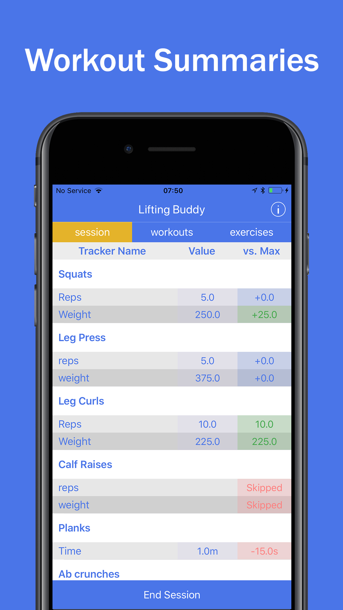
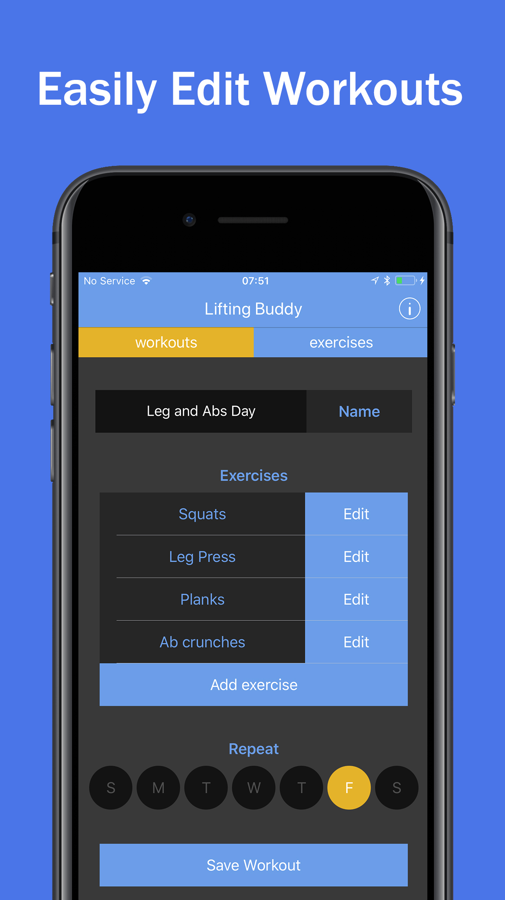

## About

  View Summaries             |  Graph Progress              | Edit Workouts Easily
:---------------------------:|:----------------------------:|:----------------------------:
 |      | 

<b>Lifting Buddy is an iOS application designed to help you keep track of your workout progress.</b>

In this readme and app, "PGM" stands for Progression Method.

[App Store Link](https://itunes.apple.com/us/app/lifting-buddy-workout-tracker/id1328144255?ls=1&mt=8)

## Setup

To run this application using XCode, you will need to have CocoaPods installed.

1. [Recursively clone the repository](https://stackoverflow.com/questions/3796927/how-to-git-clone-including-submodules)
1. In the project directory, run the command "pod install".
1. Open the .xcworkspace file

## Road Map:

The below roadmap is not in "order of implementation"; I generally work on what I want to.

  Process                    | Step | Notes
:---------------------------:|:----:|:-------------------------------------------------------:
Exercise Creation | 9/10 | Add nice way to choose progression method unit
Optional exercise in workout | 0/10 | Will require realm migration; Avoiding for now
PGM Max -> Best Conversion | 0/10 | Will require realm migration; Avoiding for now
One Rep Max Tracker | 0/10 | Should be implemented on the summary view

##### Explanations
* <b>Optional exercise in workout</b> - The user should be able to set exercises as "optional" within a workout. However, I'm still not comfortable with performing realm migrations (the app tends to crash when I attempt to do so)
* <b>PGM Max -> Best Conversion</b> - Sometimes, the user wants the lowest possible value instead of the highest possible value (think assisted pullups, etc). To do so, I want progressionmethods to have a "max/min is best" option. This also requires pgms to undergo a realm migration.
* <b>One Rep Max Tracker</b> - Feature request

## Known Bugs
* HIGH
	* No high priority bugs at this time 
* MEDIUM
	* No medium priority bugs at this time
* LOW [Can workaround]
	* No low priority bugs at this time

## Future plans
* Convert relevant UIViews into ViewControllers (good practice) 
   Update from 11/29 -- my shower thoughts said this wasn't a good idea. Reason being that containerviewcontrollers would require the frames to be set anyway, which is what I wanted to avoid 
* Add "Feature Poll", a poll that users can use to vote on for the next feature 
* Log in to sync and backup workouts

   
#### Special Thanks
Alex Bridgeman - For giving me the idea for this application. Alex also created the splash screen and launch screen!
   
